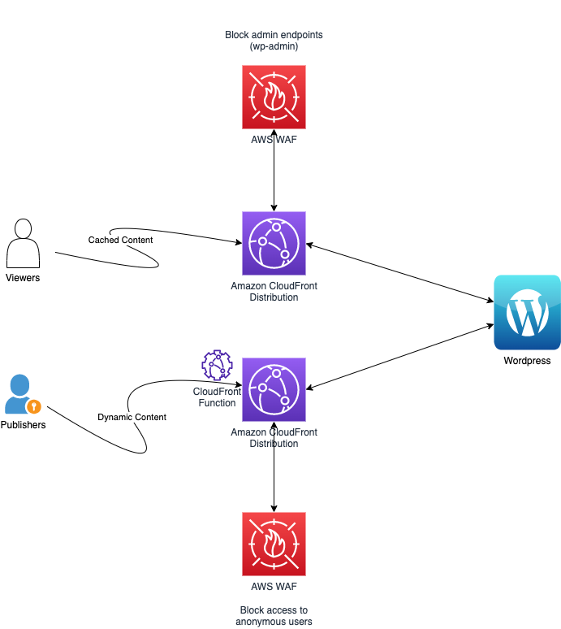

# Secure and accelerate your WordPress CMS with Amazon CloudFront, AWS WAF and Edge Functions

The purpose of this repository is to secure and accelerate an existing WordPress website by leveraging AWS Edge Services : Amazon CloudFront, Amazon CloudFront Functions and AWS WAF (Web Application Firewall). 

## Prerequisites

1. NodeJS (v. 16.3+) NodeJS is required for running and installing AWS CDK. You can download it [here](https://nodejs.org/en/download/).
1. AWS CDK (v. 2.35.0): This solution uses AWS CDK for deployment. If you aren't familiar with CDK, please install its [prerequisites](https://cdkworkshop.com/15-prerequisites.html) and follow the  [Python workshop](https://cdkworkshop.com/30-python.html) first.

## Architecture

Below is the high level architecture of the solution we will deploy




## Components 

The main components of this solution are in the folder wordpress_cloudfront :

1. `cloudfront_stack` will deploy the Consumers and publishers distributions
2. `waf_acls_stack` will deploy the 2 AWS WAFs + ACLs for Consumers and Publishers distributions
3. `certifcate_stack` will deploy a certificate to configure SSL configuration


## Deployment steps

### Init  the stack

Position yourself in the wordpress-cloudfront folder if not already

```
cd wordpress-cloudfront
```

Create a virtualenv on MacOS and Linux:

```
$ python3 -m venv .venv
```

Activate your virtualenv
```
$ source .venv/bin/activate
```

Install the required dependencies.

```
$ pip install -r requirements.txt
```

Synthesize the CloudFormation template for this code.

```
$ cdk synth
```
### Deploy  the stack

Deploy the stack without CNAMEs created for the CloudFront Distributions

```
cdk deploy --all --context WordpressOriginURL="xxxxxx.us-east-2.elb.amazonaws.com"  
```

Deploy the stack with CNAMEs created for the CloudFront Distributions

```
cdk deploy --all --context WordpressOriginURL="xxxxxx.us-east-2.elb.amazonaws.com" --context WordpressOriginIsHTTPS=true --context WordpressDomainConsumers="wordpress-consumers" --context WordpressDomainPublishers="wordpress-publishers" --context HostedZoneId="XXXXXXXXXXXX" --context HostedZoneName="mydomain.com" 
```

### Parameters 
```
1. `WordpressOriginURL` : URL of the existing Wordpress endpoint (Mandatory)
2. `WordpressOriginIsHTTPS` : If "true" Cloudfront will connect to the origin on HTTPS with a valid certificate, "false" otherwise (Optinal. default = false)
3. `WordpressDomainConsumers` : Domain of the consumers (Optional)
4. `WordpressDomainPublishers` : Domain of the publishers (Optional)
6. `HostedZoneId` : Hosted Zone Id used to create a custom DNS for the distributions (Optional - Mandatory if WordpressDomainConsumers/WordpressDomainPublishers defined
7. `HostedZoneName` : Hosted Zone Name used to create a custom DNS for the distributions (Optional - Mandatory if WordpressDomainConsumers/WordpressDomainPublishers defined)

```

In the CloudFormation console or the CDK output, get the values for `Publishers URL` and `Consumers URL`

### Destroy the stack

```
cdk destroy --all
```

Enjoy!


